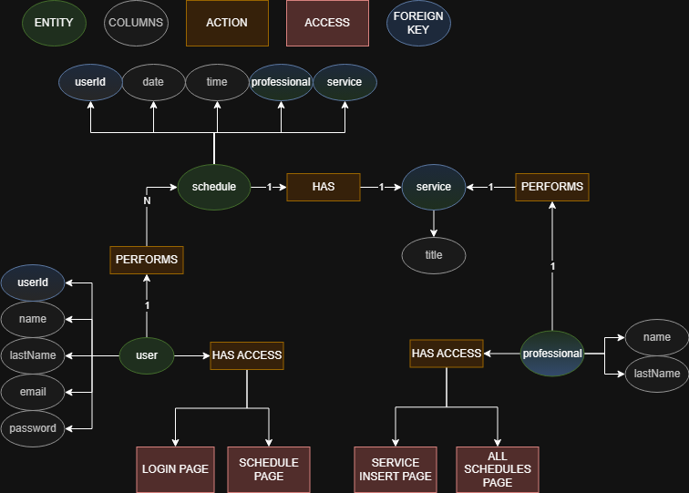

# Barber Shop 
This simple project, simule a barber shop system.

## Table of contents  
- [Database Phase](#database)  
    - [Database concept model](#modelDB)
 

<h2 name="database">Database Phase</h2>  

<h3 name="modelDB">Creating the concept model for database</h3>

On this phase, I created a conceptional model for database using [DRAW.IO](https://draw.io/). And you can see this model on image below.

